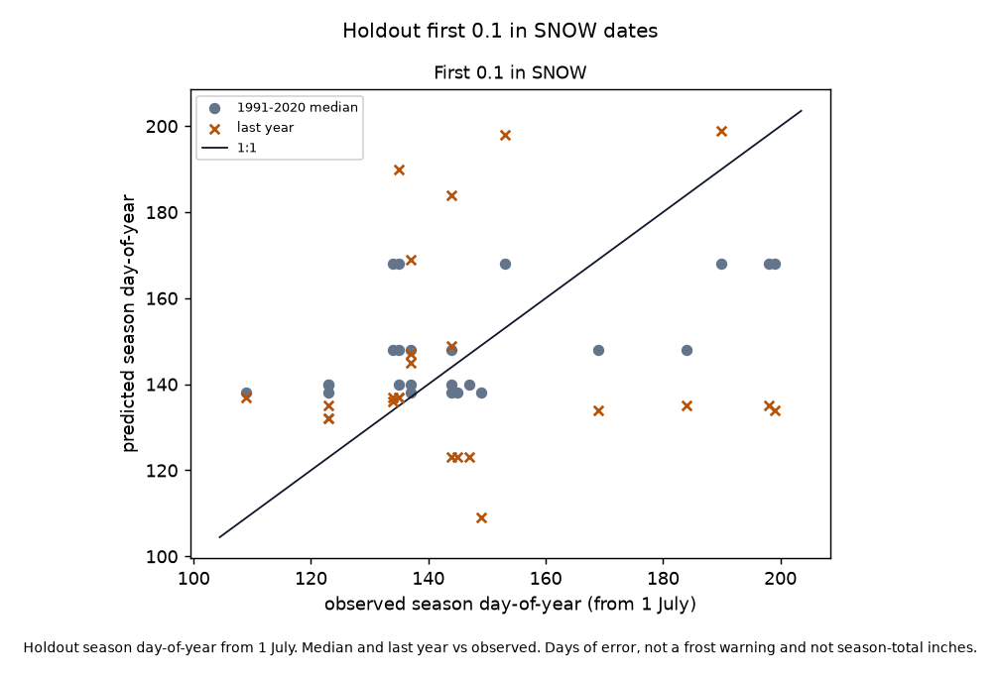
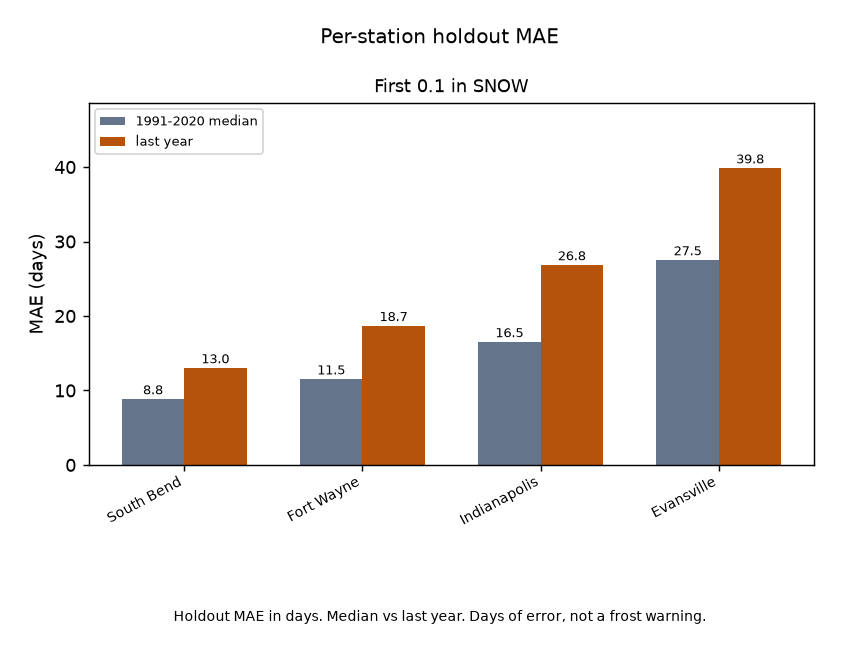

# Indiana first measurable snow date vs 1991-2020 median

Does last year's first 0.1 in GHCND SNOW date beat the 1991-2020 median date at held-out Indiana GHCND cores?

No. Locked `0ace8a1`. Last year is worse than the 1991-2020 median on holdout MAE and RMSE (24.6 vs 16.1 MAE days; 31.6 vs 19.4 RMSE). MAE and RMSE agree. Counts of winters where last year had the smaller absolute error (10/24) are not the method. South Bend 13.00 vs 8.83 is a loss on six winters, not a northern win. Evansville 39.83 vs 27.50. Those rows stay in the station table. Pages stay off.

Holdout n=24 station-winters on the four cores (winters 2019-20 through 2024-25). Train: winters 1991-92 through 2018-19. Confirmation 2025-26 is out of train and out of the median.

Parents stay frozen: freeze `28941fb`, ENSO-freeze `d861556`, DJF snow `9aa7935`, NWI lake snow `82ce0ce`. The four-core lead is South Bend, Fort Wayne, Indianapolis, and Evansville.

[First/last 32 °F](https://github.com/martialsystems/indiana_freeze_date) [October plus ENSO freeze dates](https://github.com/martialsystems/indiana_freeze_enso) [DJF snow tercile](https://github.com/martialsystems/indiana_djf_snow_tercile) [DJF above-normal frequency](https://github.com/martialsystems/indiana_djf_snow_freq) [NWI lake-belt snow](https://github.com/martialsystems/nwi_lake_effect_snow) [Temp writeup](https://gist.github.com/martialsystems/e5de316dbb5f672573906572730e3735)

Cores: South Bend `USW00014848`, Fort Wayne `USW00014827`, Indianapolis `USW00093819`, Evansville `USW00093817`. Label is first GHCND SNOW ≥ 0.1 in on 1 July Y through 30 June Y+1. Valparaiso `USW00004846` SNOW is thin (train n=0) and is dropped. Michigan City `USC00125604` stays out.



Figure 1. Holdout season day-of-year from 1 July. Median and last year vs observed. Days of error, not a frost warning and not season-total inches.



Figure 2. Holdout MAE in days. Median vs last year. Days of error, not a frost warning.

## Live skill (held-out winters)

Locked from `logs/in_live/stage_c_report.json`. Days. Four cores. The fixture is not the result.

| Target | Median MAE | Last year MAE | Median RMSE | Last year RMSE |
|--------|-----------:|--------------:|------------:|---------------:|
| First 0.1 in SNOW | 16.08 | 24.58 | 19.37 | 31.61 |

### Per station

| Station | Median MAE | Last year MAE |
|---------|-----------:|--------------:|
| South Bend `USW00014848` | 8.83 | 13.00 |
| Fort Wayne `USW00014827` | 11.50 | 18.67 |
| Indianapolis `USW00093819` | 16.50 | 26.83 |
| Evansville `USW00093817` | 27.50 | 39.83 |

Train-era median first-snow dates (month-day): South Bend 17 Nov, Fort Wayne 15 Nov, Indianapolis 25 Nov, Evansville 15 Dec.

Confirmation 2025-26 last year MAE 14.25 vs median 16.50 (n=4) does not reopen a page. Fixture skill does not rescue live.

## Stage 0

Synthetic first-snow dates at the four cores. A thin Valparaiso row is dropped under the 80% floor. Fixture skill does not rescue live.

```bash
python3.12 -m venv .venv
source .venv/bin/activate
pip install -r requirements.txt
PYTHONPATH=src:. python3 scripts/run_fixture.py logs/stage0_fixture
.venv/bin/python -m pytest tests -q
PYTHONPATH=src:. python3 scripts/run_live.py logs/in_live data/raw
```

Empty GHCND SNOW for a required core stops (`run_live.py` exit 2). Two figures max.

| File | Role |
|------|------|
| [METHODOLOGY.md](METHODOLOGY.md) | Locked contract |
| [AGENTS.md](AGENTS.md) | Agent rules |
| [CHECKLIST.md](CHECKLIST.md) | Operator list |
| `src/snowdate/` | GHCND SNOW, first 0.1 in date, median, last year, figures |
| `snowdateforge/` | GraphForge pin |

Temp writeup: https://gist.github.com/martialsystems/e5de316dbb5f672573906572730e3735

Research index: https://gist.github.com/martialsystems/66b896b0a4a0b8cba2b478aef64312f3
